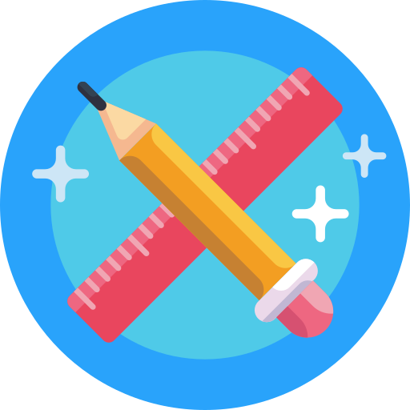
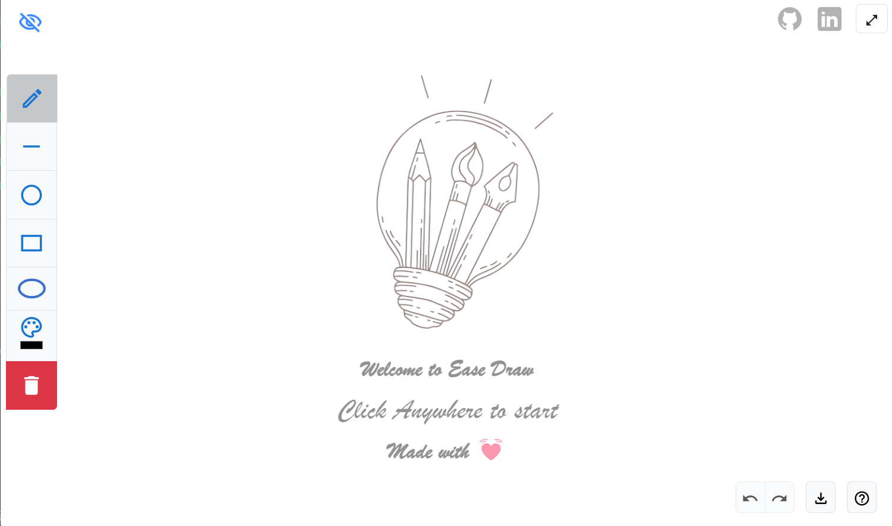

<a href="https://easedraw.vercel.app/">
 

# PROJECT - EaseDraw 🔗  

</a>


Project EaseDraw is an online whiteboard platform designed to enhance collaboration and creativity in virtual environments.

 With its intuitive and user-friendly interface, EaseDraw provides a seamless space for individuals to brainstorm, sketch, and share ideas in real-time.

 > Support, ⭐ the repository!

 



## Installation
To set up EaseDraw locally for development or testing purposes, follow these steps:

- Clone the repository: ```git clone https://github.com/your-username/easedraw.git```
- Navigate to the project directory: ```cd easedraw```
- Install dependencies: ``` npm install ```
- Start the development server: ```npm run dev ```

## Upcoming features
- Real-time whiteboard sharing.
- Adding text functionalities.
- Dynamic fill, strokewidth, roughness.

## Folder Structure
```
EaseDraw/
├─ node_modules/
├─ public/
│  ├─ favicon.ico 
├─ src/
│  ├─ components/
|  |   ├─ Navbar
|  |   |   ├─ Navbar.jsx
|  |   |   ├─ github.png
|  |   ├─ Placeholder
|  |   |   ├─ Placeholder.jsx
|  |   |   ├─ placeh.png
|  |   ├─ Toolbar
|  |   |   ├─ index.jsx
|  |   ├─ Whiteboard
|  |   |   ├─ index.jsx
|  |   ├─ KeyboardShortcuts
|  |   |   ├─ Shortcuts.jsx
│  ├─ pages
|  |   ├─ Roomspage
|  |   |   ├─ index.jsx
│  ├─ App.jsx
│  ├─ main.jsx
│  ├─ App.css
├─ index.html
├─ .gitignore
├─ package.json
├─ README.md
```

## Dependencies

|RoughJS|React|Bootstrap|Material UI| Vitejs|Vercel|
|:-:|:-:|:-:|:-:|:-:|:-:|
||||||

 ## Contributing

Contributions are whole-heartedly welcomed! If you have any ideas for improvement or bug fixes, please open an issue or submit a pull request.⚡


> Happy Drawing!🎨


